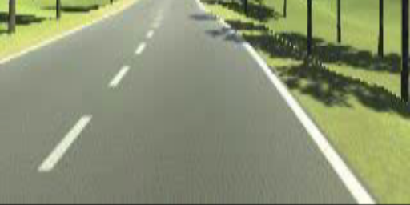

# via-line-detection

repo này huấn luyện mạng phát hiện vạch kẻ đường, được tích hợp trong dự án [via]().

## Công việc đã thực hiện

- [ ] Triển khai mạng với các frame-work khác nhau.
    - [x] Pytorch.
    - [ ] Onnx.
    - [ ] TensorRT.

- [x] Cung cấp dữ liệu.

- [x] Xây dựng mạng.
    - [x] PiNet

- [x] Huấn luyện mạng.
    - [x] PiNet

- [x] Cung cấp pre-train model.
    - [x] PiNet Pytorch
    - [ ] PiNet Onnx
    - [ ] PiNet TensorRT

- [ ] Xây dựng metrics đánh giá.

- [x] Demo kết quả.
    - [x] Demo kết quả trên ảnh
    - [x] Demo kết quả trên video

## Kết quả
Image


Video


## Cài đặt môi trường

- Cài đặt python >= 3.6

- Cài đặt môi trường và tạo môi trường mới:
```
sudo pip install virtualenv

virtualenv venv

source venv/bin/activate
```
- Cài đặt thư viện: 
    Các thư viện yêu cầu trong requirements.txt 
```
pip install -r requirements.txt
```

## Cấu trúc thư mục

```
via-lines_detection
├──dataset
|     ├── train.txt
|     ├── val.txt
|     ├── data
│     |   ├── *.txt
│     |   ├── *.jpg
├──images_test                     # put images you want to test here
│     ├── demo_image_.jpg   
├── src
|    ├── *.py
|    ├── savefile
│    |   ├── here                   # put pre-train models here
│    |   ├── *.pkl
|
├── video                           # put videos your want to test here
|    ├── *.mp4
|
├── README.md
├── LICENSE               
├── demo_line_detection.py
├── demo_line_detection_onnx.py
├── demo_line_detection_trt.py
```
## Các bước huấn luyện mạng

B1: Tải dữ liệu.

B2: Xử lý dữ liệu.

B3: Xây dựng mạng.

B4: Viết metrics và hàm loss đánh giá.

B5: Huấn luyện.

B6: Chạy Demo.

## Xử lý dữ liệu

Dữ liệu gốc nhóm via cung cấp có độ phân giải 640x250, sẽ được resize về kích thước 512x256. dữ liệu sẽ được đưa qua một hàm homography để có được birdview.

Ảnh đầu ra sau khi tiền xử lý:



Tập dữ liệu "dataset-line-detection" đã chứa các hình ảnh được warp sẵn, nếu sử dụng hình trong tập dữ liệu trên có thể bỏ qua bước này.

## Cấu trúc mạng PiNet
Tham khảo [1].
1.1 Pinet


1.2 Hourglass network


## Tham khảo

[1]. Lane Detection: [Key Points Estimation and Point Instance Segmentation Approach for Lane Detection](https://arxiv.org/abs/2002.06604)

[2]. [PINet](https://github.com/koyeongmin/PINet)
